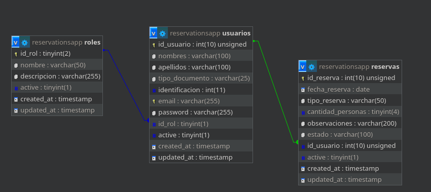

# Backend app para reservas usando Spring Boot y MySQL

Este proyecto puede integrarse con el front del siguiente enlace: [github](https://github.com/usersantiago/appreservas-front-full)

De acuerdo a este modelo de base de datos, el cliente debe poder realizar un registro con sus datos básicos y los datos para reservar un lugar. Lo ideal es que, al momento de que el cliente haga su primer registro, se le asigne el rol de "cliente". Con este rol, el cliente solo podrá ver su propia información y las reservas que haya realizado anteriormente.

Al administrador se le asigna directamente el rol de "admin" en la base de datos, lo que le permite realizar ediciones de datos de la reserva, confirmar la reserva y ver el listado de todas las reservas. Además, el administrador puede utilizar varios filtros para consultar de manera más fácil.

## Database Model

